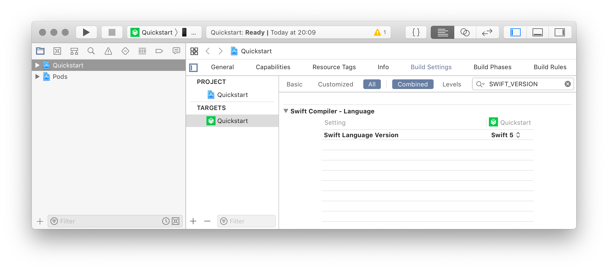
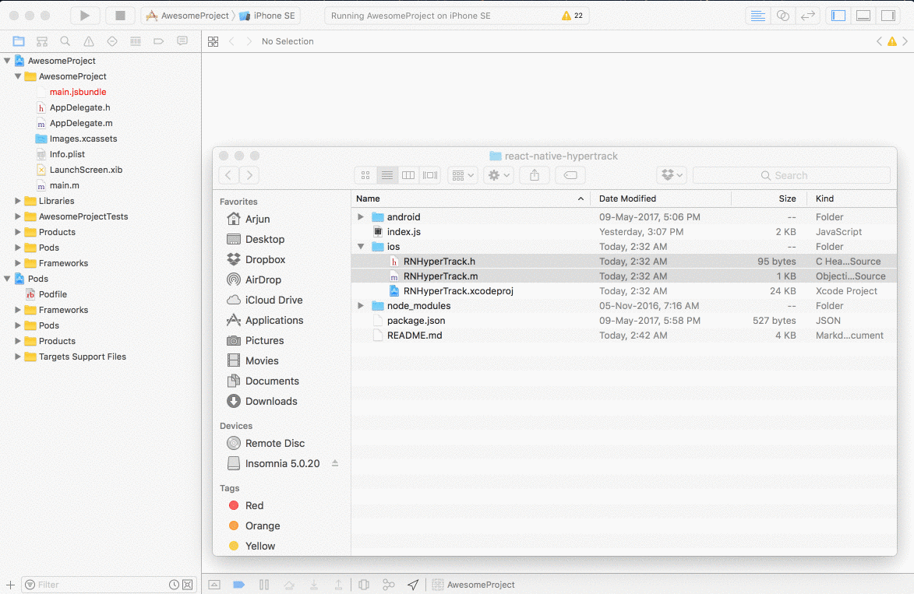
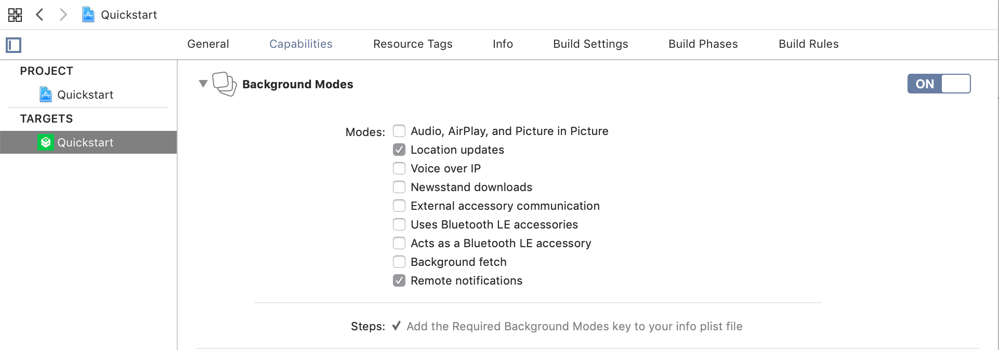
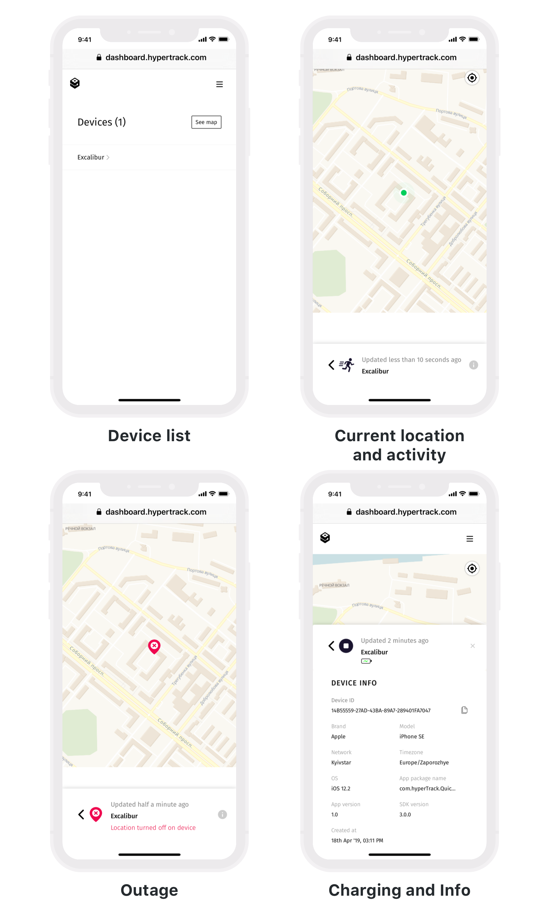

You can [start with the Quickstart app](#quickstart-app), or can [integrate the React Native SDK](#integrate-the-react-native-sdk) in your app.

## Quickstart app

1. [Clone this repo](#step-1-clone-this-repo)
2. [Install the SDKs dependencies](#step-2-install-the-sdks-dependencies)
3. [Set your Publishable Key](#step-3-set-your-publishable-key)
4. [Run the Quickstart app](#step-4-run-the-quickstart-app)

### Step 1: Clone this repo
```bash
git clone https://github.com/hypertrack/quickstart-react-native.git
cd quickstart-react-native
```

### Step 2: Install the SDKs Dependencies

#### General Dependencies

```bash
yarn
```

or

```bash
npm install
```

#### iOS Dependencies

Quickstart app uses [CocoaPods](https://cocoapods.org) dependency manager to install the latest version of the iOS SDK. Using the latest version is advised.

If you don't have CocoaPods, [install it first](https://guides.cocoapods.org/using/getting-started.html#installation).

```bash
cd ios
pod install
```

### Step 3: Set your Publishable Key

Open the `App.js` file. Locate the line with `publishableKey: "YOUR_PUBLISHABLE_KEY"` in the App class and set your [Publishable Key](#publishable-key) inside the placeholder.

### Step 4: Run the Quickstart app

To run the iOS version open the app's workspace file (`/ios/Quickstart.xcworkspace`) with Xcode. Select your device and hit Run.

To run the Android version execute `react-native run-android` in the repo's root directory.

After enabling location and activity permissions (choose "Always Allow" if you want the app to collect location data in the background), SDK starts collecting location and activity data. You can start or stop tracking with the button below.

Check out the [dashboard](#dashboard) to see the live location of your devices on the map.

## Integrate the SDK

You will need either [npm](https://www.npmjs.com/) or [Yarn](https://yarnpkg.com) in order to install the SDK and configure the Android and iOS projects.

1. [Create React Native project](#step-1-create-react-native-project)
2. [Install JavaScript packages](#step-2-install-javascript-packages)
3. [Configure projects](#step-3-configure-projects)
4. [Enable remote notifications](#step-4-enable-remote-notifications)
5. [Usage](#step-5-usage)

### Step 1: Create React Native project

First create a React Native project:

```bash
react-native init YourApp
```

### Step 2: Install JavaScript packages

Run `yarn` (or `npm install`, if using npm) inside your new `YourApp` directory:

```bash
cd YourApp
yarn
```

Then, install the `hypertrack-sdk-react-native` package:

```bash
yarn add hypertrack-sdk-react-native
```

> Or, if using npm:

```bash
npm install hypertrack-sdk-react-native
```

Finally, link the SDK to configure the iOS and Android projects:

```bash
react-native link hypertrack-sdk-react-native
```
### Step 3: Configure projects

#### Android

Assuming you have [Android Studio](http://developer.android.com/sdk/index.html) installed, open the project with Android Studio.
You also have to add `ANDROID_SDK_ROOT=<path-to-android-sdk>` in `PATH` or `sdk.dir=<path-to-android-sdk>` in `/android/local.properties`

Go to `MainApplication.java` under `app/src/main/java/com/<project name>/` to complete setup.

Register SDK package in method `getPackages()`.

```java
import com.hypertrack.reactnative.androidsdk.HTSDKPackage;

// ...

private final ReactNativeHost mReactNativeHost = new ReactNativeHost(this) {
    @Override
    public boolean getUseDeveloperSupport() {
      return BuildConfig.DEBUG;
    }

    @Override
    protected List<ReactPackage> getPackages() {
      return Arrays.<ReactPackage>asList(
          new MainReactPackage(),
          new HTSDKPackage()
      );
    }
};
```

Add in your `settings.gradle`:

```
include ':hypertrack-sdk-react-native'
project(':hypertrack-sdk-react-native').projectDir = new File(rootProject.projectDir, '../hypertrack-sdk-react-native/android')
```

You can skip the build.gradle changes since that's taken care of by the npm link step above, but **make sure** you follow the rest of the steps such as updating `AndroidManifest.xml`.

**project stage:**
```
allprojects {
    repositories {
        ...
        maven {
            name 'hypertrack'
            url 'http://m2.hypertrack.com'
        }
    }
}
```
**app stage:**
```
dependencies {
    ...
    implementation project(":hypertrack-sdk-react-native")
}
```

Set `allowBackup` to `true` in `android > app > src > main > AndroidManifest.xml`. This allows HyperTrack to persist important tracking metadata between app updates.

```
    <application
      ...
      android:allowBackup="true">
```

#### iOS

##### Add HyperTrack iOS SDK to your Podfile

The native iOS SDK is distributed using [CocoaPods](https://cocoapods.org) dependency manager.

If you don't have CocoaPods, [install it first](https://guides.cocoapods.org/using/getting-started.html#installation). Using the latest version is advised.

In your project's `ios` directory, create a Podfile (if you don't have one).

```bash
cd ios
pod init
```

Edit the Podfile to include `HyperTrack` as a dependency for your project by adding `pod 'HyperTrack'` line in your target. HyperTrack iOS SDK supports iOS 11 and above, that's why `platform :ios, '11.0'` is included explicitly. And lastly, add the `post_install` script to keep dependencies with the correct Swift version.

```bash
platform :ios, '11.0'

target 'YourApp' do
  use_frameworks!
  pod 'HyperTrack'
end

post_install do |installer|
  installer.pods_project.targets.each do |target|
    if ['GRDB.swift'].include? target.name
      target.build_configurations.each do |config|
        config.build_settings['SWIFT_VERSION'] = '4.2'
      end
    end
  end
end
```

Check the Swift version in build settings. Open your `.xcodeproj` project file with Xcode. Select the projects Xcode project file in the navigator, go to your app's target (Should be with the same name as a project name) > Build Settings and search for `SWIFT_VERSION` flag. If there isn't one, create a new Swift file without creating a bridging header, and Xcode will create this setting for you. Set it to `4.2`. You can then delete the file.



Install the native HyperTrack SDK through CocoaPods:

```bash
pod install
```

##### Manually link the wrapper code.

After Cocoapods is finished installing dependencies, we need to manually link the wrapper code. This is a **required** step, in addition to the link command described previously.

1. Open the iOS module files directory, located inside `node_modules/hypertrack-sdk-react-native/ios/`.
2. Open the app's workspace file (`.xcworkspace`) in Xcode.
3. Move the `HyperTrack.h` and `HyperTrack.m` files to your project. When shown a popup window, select `Create folder references` and make sure `Copy items if needed` is deselected. This will allow these files to update every time the JS module updates.



##### Enable background location updates

Enable Background Modes in your project target's Capabilities tab. Choose "Location updates".


##### Add purpose strings

Set the following purpose strings in the `Info.plist` file:


You can ask for "When In Use" permission only, but be advised that the device will see a blue bar at the top while your app is running.


Be advised, purpose strings are mandatory, and the app crashes without them.

### Step 4: Enable remote notifications

The SDK has a bi-directional communication model with the server. This enables the SDK to run on a variable frequency model, which balances the fine trade-off between low latency tracking and battery efficiency, and improves robustness. This also enables HyperTrack Trips to start and stop tracking automatically when trip starts and ends. For this purpose, the iOS SDK uses APNs silent remote notifications and Android SDK uses FCM silent notifications.

#### Android

This guide assumes you have configured FCM in your application. If you haven't, read the [Firebase guide](https://firebase.google.com/docs/android/setup).

##### Configure FCM key on the Dashboard

Log into the HyperTrack dashboard, and open the [setup page](https://dashboard.hypertrack.com/setup). Enter your FCM Key.

This key will only be used to send remote push notifications to your apps.

###### Enable server to device communication

Specify `HyperTrackMessagingService` as push messages receiver by adding following snippet to your app's Android manifest:

```xml
...
  <service android:name="com.hypertrack.sdk.HyperTrackMessagingService" android:exported="false">
      <intent-filter>
          <action android:name="com.google.firebase.MESSAGING_EVENT" />
      </intent-filter>
  </service>
</application>
```

If you already use firebase push notifications you can extend `HyperTrackMessagingService` instead of Firebase, or declare two receivers side by side, if you wish.

Check out [Quickstart app with notifications integrated](https://github.com/hypertrack/quickstart-android/tree/push-integration-example) if you prefer to get a look at example.

#### iOS

This guide assumes you have configured APNs in your application. If you haven't, read the [iOS documentation on APNs](https://developer.apple.com/documentation/usernotifications/registering_your_app_with_apns).

##### Configure APNs on the dashboard

Log into the HyperTrack dashboard, and open the [setup page](https://dashboard.hypertrack.com/setup). Upload your Auth Key (file in the format `AuthKey_KEYID.p8`) and fill in your Team ID.

This key will only be used to send remote push notifications to your apps.

##### Enable remote notifications in the app

In the app capabilities, ensure that **remote notifications** inside background modes is enabled.



In the same tab, ensure that **push notifications** is enabled.


##### Registering and receiving notifications

The following changes inside AppDelegate will register the SDK for push notifications and route HyperTrack notifications to the SDK.

###### Register for notifications

Inside `didFinishLaunchingWithOptions`, use the SDK method to register for notifications.

```objc
- (BOOL)application:(UIApplication *)application didFinishLaunchingWithOptions:(NSDictionary *)launchOptions {
    [HTSDK registerForRemoteNotifications];
    return YES;
}
```

###### Register device token

Inside and `didRegisterForRemoteNotificationsWithDeviceToken` and `didFailToRegisterForRemoteNotificationsWithError` methods, add the relevant lines so that HyperTrack can register the device token.

```objc
- (void)application:(UIApplication *)application didRegisterForRemoteNotificationsWithDeviceToken:(NSData *)deviceToken {
    [HTSDK didRegisterForRemoteNotificationsWithDeviceToken:deviceToken];
}

- (void)application:(UIApplication *)application didFailToRegisterForRemoteNotificationsWithError:(NSError *)error {
    [HTSDK didFailToRegisterForRemoteNotificationsWithError:error];
}
```

###### Receive notifications

Inside the `didReceiveRemoteNotification` method, add the HyperTrack receiver. This method parses only the notifications that sent from HyperTrack.

```objc
- (void)application:(UIApplication *)application didReceiveRemoteNotification:(NSDictionary *)userInfo fetchCompletionHandler:(void (^)(UIBackgroundFetchResult))completionHandler {
    [HTSDK didReceiveRemoteNotification:userInfo fetchCompletionHandler:completionHandler];
}
```

If you want to make sure to only pass HyperTrack notifications to the SDK, you can use the "hypertrack" key:

```objc
- (void)application:(UIApplication *)application didReceiveRemoteNotification:(NSDictionary *)userInfo fetchCompletionHandler:(void (^)(UIBackgroundFetchResult))completionHandler {
    if (userInfo[@"hypertrack"] != nil) {
        // This is HyperTrack's notification
        [HTSDK didReceiveRemoteNotification:userInfo fetchCompletionHandler:completionHandler];
    } else {
        // Handle your server's notification here
    }
}
```

### Step 5: Usage

```js
// Import HyperTrack SDK API
// You can also use CriticalErrors to react to different kind of errors preventing tracking (ex: permissions deined)
import {CriticalErrors, HyperTrack} from 'hypertrack-sdk-react-native';

export default class App extends Component {

    state = {
        deviceID: "",
        isTracking: true
    };

    _initializeHyperTrack = async () => {
        // (Optional) This turns on logging for underlying native SDKs. Placed on top so SDKs start logging immediately
        HyperTrack.enableDebugLogging(true);

        // Initialize HyperTrack with a publishable key
        this.hyperTrack = await HyperTrack.createInstance("paste_your_key_here");

        // Obtain the unique HyperTrack's DeviceID identifier to use it with HyperTrack's APIs
        const deviceID = await this.hyperTrack.getDeviceID();
        this.setState({deviceID: deviceID});

        // (Optional) Set the device name to display in dashboard (for ex. user name)
        this.hyperTrack.setDeviceName("Your Device Name");

        // (Optional) Attach any JSON metadata to this device to see in HyperTrack's API responses
        this.hyperTrack.setMetadata({driver_id: "83B3X5", state: "IN_PROGRESS"});

        // (Optional) Register tracking listeners to update your UI when SDK starts/stops or react to errors
        this.hyperTrack.registerTrackingListeners(this,
            // Log errors or update UI accordingly
            (error) => {
                if (error.code === CriticalErrors.INVALID_PUBLISHABLE_KEY
                    || error.code === CriticalErrors.AUTHORIZATION_FAILED) {
                    console.log("Initialization failed")
                } else {
                    console.log("Tracking failed")
                }
            },
            // Update UI when tracking starts
            () => this.setState({isTracking: true}),
            // Update UI when tracking stops
            () => this.setState({isTracking: false})
        );


    };

    // Call the initialization in componentWillMount
    componentWillMount() {
        this._initializeHyperTrack();
    }

    // (Optional) Unregister tracking listeners if they were registered in previous step
    componentWillUnmount() {
        this.hyperTrack.unregisterTrackingListeners(this);
    }

}
```

### You are all set

You can now run the app and start using HyperTrack. You can see your devices on the [dashboard](#dashboard).

## Dashboard

Once your app is running, go to the [dashboard](https://dashboard.hypertrack.com/devices) where you can see a list of all your devices and their live location with ongoing activity on the map.




## Frequently Asked Questions

### iOS
- [What iOS versions are supported](#supported-versions-on-ios)
- [Error: Access to Activity services has not been authorized](#error-access-to-activity-services-has-not-been-authorized)

#### Supported versions on iOS

Currently we do support all of the iOS versions starting from iOS 11.

#### Error: Access to Activity services has not been authorized
You are running the Quickstart app on the iOS simulator, which currently does not support CoreMotion services. You can test the quickstart app on real iOS devices only.

### Android
- [What API levels (Android versions) are supported](#supported-versions-on-android)
- [NoClassDefFoundError](#javalangnoclassdeffounderror)
- [Dependencies Conflicts](#dependencies)
- [Persistent notification](#persistent-notification)
- [Handling custom ROMs](#handling-custom-roms)
- [HyperTrack notification shows even after app is terminated](#hypertrack-notification-shows-even-after-my-app-is-terminated)

#### Supported versions on Android
Currently we do support all of the Android versions starting from API 19 (Android 4.4 Kit Kat)

#### java.lang.NoClassDefFoundError
I've added SDK and my app started failing with message like `Fatal Exception: java.lang.NoClassDefFoundError`.
The reason of it, is that on Android API level 19 and below you cannot have more than 65536 methods in your app (including libraries methods). Please, check [this Stackoverflow](https://stackoverflow.com/questions/34997835/fatal-exception-java-lang-noclassdeffounderror-when-calling-static-method-in-an) answer for solutions.

#### Dependencies
SDK dependencies graph looks like below:

    +--- com.android.volley:volley:1.1.0
    +--- com.google.code.gson:gson:2.8.5
    +--- org.greenrobot:eventbus:3.1.1
    +--- com.parse.bolts:bolts-tasks:1.4.0
    +--- net.grandcentrix.tray:tray:0.12.0
    |    \--- com.android.support:support-annotations:23.0.1 -> 28.0.0
    +--- com.google.android.gms:play-services-location:16.0.0
    |    +--- com.google.android.gms:play-services-base:16.0.1
    |    |    +--- com.google.android.gms:play-services-basement:16.0.1
    |    |    |    \--- com.android.support:support-v4:26.1.0
    |    |    |         +--- com.android.support:support-compat:26.1.0
    |    |    |         |    +--- com.android.support:support-annotations:26.1.0 -> 28.0.0
    |    |    |         |    \--- android.arch.lifecycle:runtime:1.0.0
    |    |    |         |         +--- android.arch.lifecycle:common:1.0.0
    |    |    |         |         \--- android.arch.core:common:1.0.0
    |    |    |         +--- com.android.support:support-media-compat:26.1.0
    |    |    |         |    +--- com.android.support:support-annotations:26.1.0 -> 28.0.0
    |    |    |         |    \--- com.android.support:support-compat:26.1.0 (*)
    |    |    |         +--- com.android.support:support-core-utils:26.1.0
    |    |    |         |    +--- com.android.support:support-annotations:26.1.0 -> 28.0.0
    |    |    |         |    \--- com.android.support:support-compat:26.1.0 (*)
    |    |    |         +--- com.android.support:support-core-ui:26.1.0
    |    |    |         |    +--- com.android.support:support-annotations:26.1.0 -> 28.0.0
    |    |    |         |    \--- com.android.support:support-compat:26.1.0 (*)
    |    |    |         \--- com.android.support:support-fragment:26.1.0
    |    |    |              +--- com.android.support:support-compat:26.1.0 (*)
    |    |    |              +--- com.android.support:support-core-ui:26.1.0 (*)
    |    |    |              \--- com.android.support:support-core-utils:26.1.0 (*)
    |    |    \--- com.google.android.gms:play-services-tasks:16.0.1
    |    |         \--- com.google.android.gms:play-services-basement:16.0.1 (*)
    |    +--- com.google.android.gms:play-services-basement:16.0.1 (*)
    |    +--- com.google.android.gms:play-services-places-placereport:16.0.0
    |    |    \--- com.google.android.gms:play-services-basement:16.0.1 (*)
    |    \--- com.google.android.gms:play-services-tasks:16.0.1 (*)
    \--- com.android.support:support-annotations:28.0.0

Common problem here is depending on different versions of `com.android.support` library components. You can explicitly specify required version by adding it as a dependency in your app's `build.gradle`, e.g.:
```
  implementation `com.android.support:support-v4:28.0.0`
```
That will take precedence over SDK version and you'll have one version of support library on your classpath.

#### Persistent notification
HyperTrack SDK, by default, runs as a foreground service. This is to ensure that the location tracking works reliably even when your app is minimized. A foreground service is a service that the user is actively aware of and isn't a candidate for the system to kill when low on memory.
Android mandates that a foreground service provides a persistent notification in the status bar. This means that the notification cannot be dismissed by the user.


#### Handling custom ROMs
Smartphones are getting more and more powerful, but the battery capacity is lagging behind. Device manufactures are always trying to squeeze some battery saving features into the firmware with each new Android release. Manufactures like Xiaomi, Huawei and OnePlus have their own battery savers that kills the services running in the background.
To avoid OS killing the service, users of your app need to override the automatic battery management and set it manual. To inform your users and direct them to the right setting page, you may add the following code in your app. This would intent out your user to the right settings page on the device.

```java
try {
    Intent intent = new Intent();
    String manufacturer = android.os.Build.MANUFACTURER;
    if ("xiaomi".equalsIgnoreCase(manufacturer)) {
        intent.setComponent(new ComponentName("com.miui.securitycenter", "com.miui.permcenter.autostart.AutoStartManagementActivity"));
    }
    else if ("oppo".equalsIgnoreCase(manufacturer)) {
        intent.setComponent(new ComponentName("com.coloros.safecenter", "com.coloros.safecenter.permission.startup.StartupAppListActivity"));
    }
    else if ("vivo".equalsIgnoreCase(manufacturer)) {
        intent.setComponent(new ComponentName("com.vivo.permissionmanager", "com.vivo.permissionmanager.activity.BgStartUpManagerActivity"));
    }

    List<ResolveInfo> list = context.getPackageManager().queryIntentActivities(intent, PackageManager.MATCH_DEFAULT_ONLY);
    if  (list.size() > 0) {
        context.startActivity(intent);
    }
    }
    catch (Exception e) {
        Crashlytics.logException(e);
}
```
You may also try out open source libraries like https://github.com/judemanutd/AutoStarter.

Some manufacturers don't allow to whitelist apps programmatically. In that case the only way to achieve service reliability is manual setup. E.g. for Oxygen OS (OnePlus) you need to select *Lock* menu item from app options button in _Recent Apps_ view:


#### HyperTrack notification shows even after my app is terminated
The HyperTrack service runs as a separate component and it is still running when the app that started it is terminated. That is why you can observe that notification. When you stop tracking (`stopTracking()`), the notification goes away.

## Support
Join our [Slack community](https://join.slack.com/t/hypertracksupport/shared_invite/enQtNDA0MDYxMzY1MDMxLTdmNDQ1ZDA1MTQxOTU2NTgwZTNiMzUyZDk0OThlMmJkNmE0ZGI2NGY2ZGRhYjY0Yzc0NTJlZWY2ZmE5ZTA2NjI) for instant responses. You can also email us at help@hypertrack.com.
